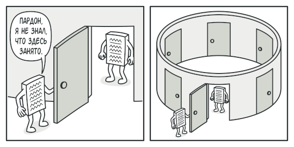
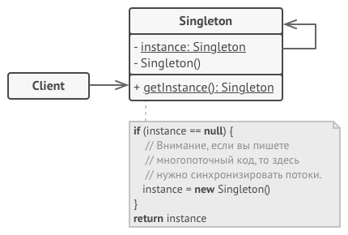

# Одиночка (**Singleton**)

### Суть паттерна

*Одиночка* — это порождающий паттерн проектирования, который гарантирует, что у класса есть только один экземпляр, и предоставляет к нему глобальную точку доступа.


### Проблема

Одиночка решает сразу две проблемы, нарушая принцип единственной ответственности класса.

* **Гарантирует наличие единственного экземпляра класса.** Чаще всего это полезно для доступа к какому-то общему ресурсу, например, базе данных.



* **Предоставляет глобальную точку доступа.** Это не просто глобальная переменная, через которую можно достучаться к определённому объекту. Глобальные переменные не защищены от записи, поэтому любой код может подменять их значения без вашего ведома.

    Но есть и другой нюанс. Неплохо бы хранить в одном месте и код, который решает проблему №1, а также иметь к нему простой и доступный интерфейс.
    
### Решение

Все реализации одиночки сводятся к тому, чтобы скрыть конструктор по умолчанию и создать публичный статический метод, который и будет контролировать жизненный цикл объекта-одиночки.

Если у вас есть доступ к классу одиночки, значит, будет доступ и к этому статическому методу. Из какой точки кода вы бы его ни вызвали, он всегда будет отдавать один и тот же объект.

### Аналогия из жизни

Правительство государства — хороший пример одиночки. В государстве может быть только одно официальное правительство. Вне зависимости от того, кто конкретно заседает в правительстве, оно имеет глобальную точку доступа «Правительство страны N».

### Структура



### Псевдокод

В этом примере роль Одиночки отыгрывает класс подключения к базе данных.

Этот класс не имеет публичного конструктора, поэтому единственный способ получить его объект — это вызвать метод getInstance. Этот метод сохранит первый созданный объект и будет возвращать его при всех последующих вызовах.

```
// Класс одиночки определяет статический метод `getInstance`,
// который позволяет клиентам повторно использовать одно и то же
// подключение к базе данных по всей программе.
class Database is
    // Поле для хранения объекта-одиночки должно быть объявлено
    // статичным.
    private static field instance: Database

    // Конструктор одиночки всегда должен оставаться приватным,
    // чтобы клиенты не могли самостоятельно создавать
    // экземпляры этого класса через оператор `new`.
    private constructor Database() is
        // Здесь может жить код инициализации подключения к
        // серверу баз данных.
        // ...

    // Основной статический метод одиночки служит альтернативой
    // конструктору и является точкой доступа к экземпляру этого
    // класса.
    public static method getInstance() is
        if (Database.instance == null) then
            acquireThreadLock() and then
                // На всякий случай ещё раз проверим, не был ли
                // объект создан другим потоком, пока текущий
                // ждал освобождения блокировки.
                if (Database.instance == null) then
                    Database.instance = new Database()
        return Database.instance

    // Наконец, любой класс одиночки должен иметь какую-то
    // полезную функциональность, которую клиенты будут
    // запускать через полученный объект одиночки.
    public method query(sql) is
        // Все запросы к базе данных будут проходить через этот
        // метод. Поэтому имеет смысл поместить сюда какую-то
        // логику кеширования.
        // ...

class Application is
    method main() is
        Database foo = Database.getInstance()
        foo.query("SELECT ...")
        // ...
        Database bar = Database.getInstance()
        bar.query("SELECT ...")
        // Переменная "bar" содержит тот же объект, что и
        // переменная "foo".
```

### Применимость

*Когда в программе должен быть единственный экземпляр какого-то класса, доступный всем клиентам (например, общий доступ к базе данных из разных частей программы).*

Одиночка скрывает от клиентов все способы создания нового объекта, кроме специального метода. Этот метод либо создаёт объект, либо отдаёт существующий объект, если он уже был создан.

*Когда вам хочется иметь больше контроля над глобальными переменными.*

В отличие от глобальных переменных, Одиночка гарантирует, что никакой другой код не заменит созданный экземпляр класса, поэтому вы всегда уверены в наличии лишь одного объекта-одиночки.

### Шаги реализации

* Добавьте в класс приватное статическое поле, которое будет содержать одиночный объект.
* Объявите статический создающий метод, который будет использоваться для получения одиночки.
* Добавьте «ленивую инициализацию» (создание объекта при первом вызове метода) в создающий метод одиночки.
* Сделайте конструктор класса приватным.
* В клиентском коде замените вызовы конструктора одиночка вызовами его создающего метода.

### Преимущества и недостатки

*+*:
* Гарантирует наличие единственного экземпляра класса.
* Предоставляет к нему глобальную точку доступа.
* Реализует отложенную инициализацию объекта-одиночки.

*-*:
* Нарушает принцип *единственной ответственности класса*.
* Маскирует плохой дизайн.
* Проблемы мультипоточности.
* Требует постоянного создания Mock-объектов при юнит-тестировании.

### Отношения с другими паттернами

* **Фасад** можно сделать **Одиночкой**, так как обычно нужен только один объект-фасад.
* Паттерн **Легковес** может напоминать **Одиночку**, если для конкретной задачи у вас получилось свести количество объектов к одному. Но помните, что между паттернами есть два кардинальных отличия:
    1. В отличие от Одиночки, вы можете иметь множество объектов-легковесов.
    2. Объекты-легковесы должны быть неизменяемыми, тогда как объект-одиночка допускает изменение своего состояния.
* **Абстрактная фабрика**, **Строитель** и **Прототип** могут быть реализованы при помощи **Одиночки**.

 